# Mycelium CNI Plugin

[](https://golang.org/)
[](https://github.com/containernetworking/cni)

A Kubernetes Container Network Interface (CNI) plugin that provides IPv6 connectivity to pods using the Mycelium overlay network on ThreeFold Grid.

## Overview

The Mycelium CNI plugin enables Kubernetes pods to communicate over IPv6 using the Mycelium network, a peer-to-peer IPv6 overlay network used in the ThreeFold Grid. This plugin:

1. Assigns unique IPv6 addresses to pods from the Mycelium network space
2. Creates virtual ethernet (veth) pairs to connect pods to the Mycelium bridge
3. Sets up appropriate routing for IPv6 traffic
4. Integrates with the ThreeFold Grid's networking infrastructure

## How It Works

The plugin performs the following operations when a pod is created:

1. Reads the network seed from `/etc/netseed`
2. Inspects the Mycelium network configuration using the ZOS base library
3. Generates a random seed for the pod's IPv6 address
4. Creates a veth pair with one end in the pod's network namespace and the other attached to the `mycelium-br` bridge
5. Configures the pod's network interface with the assigned IPv6 address
6. Sets up a default route for IPv6 traffic (`400::/7`) via the Mycelium gateway
7. Returns the result to Kubernetes CNI

### Network Architecture Diagram



This diagram illustrates how the mycelium-cni plugin integrates with Kubernetes and the Mycelium overlay network to provide IPv6 connectivity to pods.

## Prerequisites

- Kubernetes cluster running on ThreeFold Grid nodes
- `mycelium-br` bridge interface must be set up and configured (typically done by `network_setup.sh`)
- `/etc/netseed` file containing the network seed for the Mycelium network - this file is shared between the Mycelium instance running on the node and the CNI plugin, ensuring both use the same IPv6 range for pod addressing

## Installation

1. Build the CNI plugin as a static binary:

```bash
CGO_ENABLED=0 go build -ldflags "-extldflags -static" -o mycelium-cni main.go
```

2. Copy the binary to the CNI plugins directory:

```bash
cp mycelium-cni /opt/cni/bin/
```

In our K3s custom build, we use the zinit service defined in `../k3s/rootfs/etc/zinit/copy_cni_binary.yaml` to automatically copy the CNI binary to the appropriate location. This service waits for the CNI directory to be available and then copies the mycelium-cni binary from the scripts directory to the CNI plugins directory.

3. Create a CNI configuration file in `/etc/cni/net.d/` (recommended filename: `10-mycelium.conflist`):

```json
{
  "cniVersion": "0.4.0",
  "name": "mycelium",
  "type": "mycelium-cni"
}
```

The filename prefix `10-` ensures this CNI plugin is loaded before other plugins that might be present in the system, as CNI plugins are loaded in lexicographical order of their configuration filenames.

## Integration with K3s

This plugin is designed to work with K3s in the ThreeFold Grid environment. It should be used alongside the `../k3s/scripts/network_setup.sh` script that creates and configures the `mycelium-br` bridge.

## License

Licensed under the Apache License, Version 2.0.
